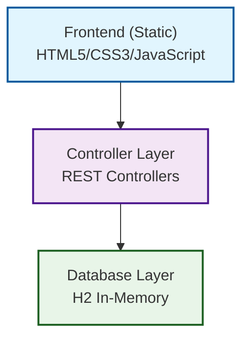

# Arquitetura do Sistema

Este documento descreve a arquitetura técnica do sistema de gerenciamento de usuários e departamentos.

## Arquitetura Geral

O sistema segue uma arquitetura em camadas (Layered Architecture) com separação clara de responsabilidades:



## Modelo de Dados

### Modelo Conceitual

```
User ────────→ Department
  │               │
  │               │
  ↓               ↓
- id            - id  
- name          - name
- email         
- department_id (FK)
```

**Relacionamento**: Muitos-para-Um (N:1)
- Um usuário pertence a **um** departamento
- Um departamento pode ter **vários** usuários

### Modelo Físico 

=== "tb_department"

| Coluna | Tipo    | Descrição              |
|--------|---------|------------------------|
| id     | BIGINT  | Chave primária (AUTO)  |
| name   | VARCHAR | Nome do departamento   |

=== "tb_user"

| Coluna        | Tipo    | Descrição                    |
|---------------|---------|------------------------------|
| id            | BIGINT  | Chave primária (AUTO)        |
| name          | VARCHAR | Nome do usuário              |
| email         | VARCHAR | Email do usuário             |
| department_id | BIGINT  | Chave estrangeira (FK)       |

## Dados de Exemplo

=== "Departamentos"

| ID | Nome         |
|----|--------------|
| 1  | Gestão       |
| 2  | Informática  |
| 3  | Vendas       |
| 4  | Marketing    |
| 5  | Financeiro   |

=== "Usuários"

| Nome  | Departamento  | Email             |
|-------|---------------|-------------------|
| Maria | Gestão        | maria@gmail.com   |
| Bob   | Gestão        | bob@gmail.com     |
| Alex  | Informática   | alex@gmail.com    |
| Ana   | Informática   | ana@gmail.com     |

## Tecnologias e Padrões

### Backend (Spring Boot)

- **REST API**: Comunicação baseada em recursos via HTTP com controle de rotas e verbos.

- **Principais Componentes**: User e Department.

```java
@Entity
public class User {
    @ManyToOne
    @JoinColumn(name = "department_id")
    private Department department;
}

@Entity  
public class Department {
    @OneToMany(mappedBy = "department")
    private List<User> users;
}
```

### Frontend (SPA Simples)

**Arquitetura Utilizada**

- **Single Page Application (SPA)**  
  Toda a aplicação roda em uma única página HTML, carregando e atualizando conteúdo dinamicamente sem recarregar a página inteira.

- **Event-Driven**  
  A navegação e as interações são controladas por eventos (ex: cliques, envio de formulários, carregamento de dados).

- **AJAX/Fetch API**  
  Comunicação assíncrona com o backend usando a API `fetch`, permitindo buscar e enviar dados sem recarregar a página.

**Fluxo de Dados:**
```
User Action → JavaScript → Fetch API → Spring Controller → Repository → Database
                    ↑                                                      ↓
Frontend Update ←──┘                                           JSON Response
```

## Fluxos de Operação

### 1. Listagem de Usuários
```
GET /users → UserController.findAll() → userRepository.findAll() → JSON Response
```

### 2. Busca por ID
```  
GET /users/{id} → UserController.findById() → userRepository.findById() → JSON Response
```

### 3. Cadastro de Usuário
```
POST /users → UserController.insert() → userRepository.save() → JSON Response
```

## Configurações de Segurança

### CORS Configuration
```java
@Configuration
public class CorsConfig {
    // Permite acesso do frontend à API
    // Origins permitidas: localhost:8080
}
```

### H2 Database Security
- **Perfil**: Desenvolvimento/Teste
- **Acesso**: Console habilitado
- **Persistência**: Em memória (dados perdidos ao reiniciar)

## Considerações de Performance
- Banco em memória (rápido para desenvolvimento)
- Sem cache implementado

## Monitoramento e Logs
- Logs padrão do Spring Boot
- Console H2 para debug

---

Desenvolvido por **Alan de Oliveira Gonçalves**   
[GitHub](https://github.com/Alan-oliveir) | [LinkedIn](https://www.linkedin.com/in/alan-ogoncalves)  
