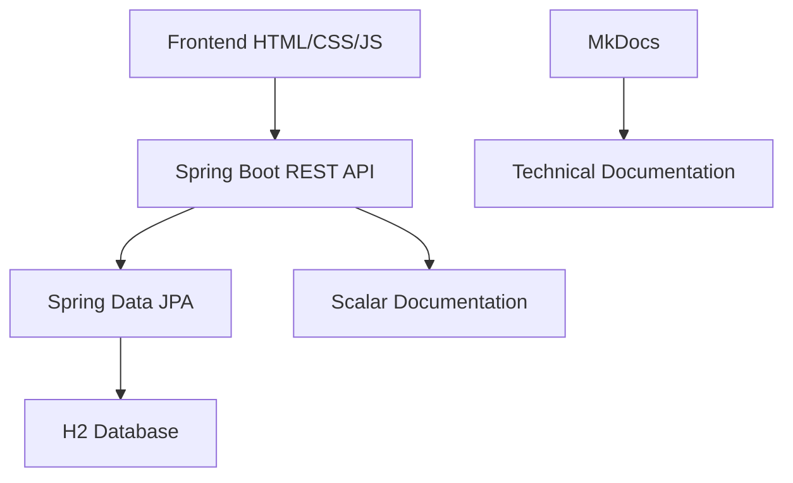

# Sistema de Usuários e Departamentos

Bem-vindo à documentação completa do **Sistema de Usuários e Departamentos** - um projeto full-stack desenvolvido com Java Spring Boot e interface web moderna.

## Visão Geral

Este sistema demonstra a implementação de uma **API REST completa** integrada com uma **interface web responsiva**, oferecendo funcionalidades de gerenciamento de usuários e seus respectivos departamentos.

## Principais Funcionalidades

### Backend (API REST)
- **Listagem completa** de usuários com departamentos
- **Busca individual** por ID  
- **Cadastro** de novos usuários
- **Documentação interativa** com Scalar
- **Configuração CORS** para integração frontend

### Frontend (Interface Web)
- **Design responsivo** para desktop e mobile
- **Integração real-time** com API REST
- **Formulários validados** com feedback visual
- **Operações assíncronas** com JavaScript puro
- **Experiência de usuário moderna**

## Tecnologias Utilizadas

=== "Backend"
    - **Java 17** - Linguagem principal
    - **Spring Boot 2.7** - Framework web
    - **Spring Data JPA** - Persistência
    - **H2 Database** - Banco em memória
    - **Maven** - Gerenciamento de dependências

=== "Frontend"
    - **HTML5** - Estrutura semântica
    - **CSS3** - Estilização e responsividade
    - **JavaScript ES6+** - Interatividade moderna

=== "Ferramentas"
    - **Scalar** - Documentação interativa da API
    - **MkDocs** - Documentação técnica
    - **IntelliJ IDEA** - IDE de desenvolvimento
    - **Postman** - Testes de API

## Demonstração

*Interface principal mostrando listagem de usuários e formulário de cadastro*

## Casos de Uso

1. **Visualização de Usuários**
   - Lista todos os usuários cadastrados
   - Exibe departamento de cada usuário
   - Interface responsiva e moderna

2. **Cadastro de Usuários**
   - Formulário validado
   - Seleção de departamento
   - Feedback visual de sucesso/erro

3. **Busca Individual**
   - Busca por ID específico
   - Tratamento de erros
   - Exibição de resultados dinâmica

## Arquitetura do Sistema

## Navegação da Documentação

- **[Guia de Início](getting-started.md)** - Como executar o projeto
- **[Arquitetura](architecture.md)** - Detalhes técnicos e modelo de dados
- **[Frontend](frontend.md)** - Documentação da interface web
- **[API Reference](api-reference.md)** - Configurações e link para Scalar
- **[Contribuição](contributing.md)** - Como contribuir com o projeto

## Contexto Educacional

Este projeto foi feito durante aula da **DevSuperior** de desenvolvimento web com Rest API e banco de dados usando Java, Spring Boot e H2; e posteriormente foi expandido com:

- Interface frontend completa
- Documentação técnica abrangente
- Boas práticas de desenvolvimento
- Ferramentas modernas de documentação

## Destaques do Projeto

!!! success "Pontos Fortes"
    - **Código limpo** e bem estruturado
    - **Documentação completa** e navegável
    - **Interface moderna** e responsiva
    - **API bem documentada** com Scalar
    - **Fácil execução** e desenvolvimento

!!! info "Ideal Para"
    - Estudantes de desenvolvimento web
    - Desenvolvedores aprendendo Spring Boot
    - Referência para projetos similares
    - Portfolio profissional

## Próximos Passos

Pronto para começar? Visite o **[Guia de Início](getting-started.md)** para instruções detalhadas de execução.

---

Desenvolvido por **Alan de Oliveira Gonçalves**   
[GitHub](https://github.com/Alan-oliveir) | [LinkedIn](https://www.linkedin.com/in/alan-ogoncalves)  
